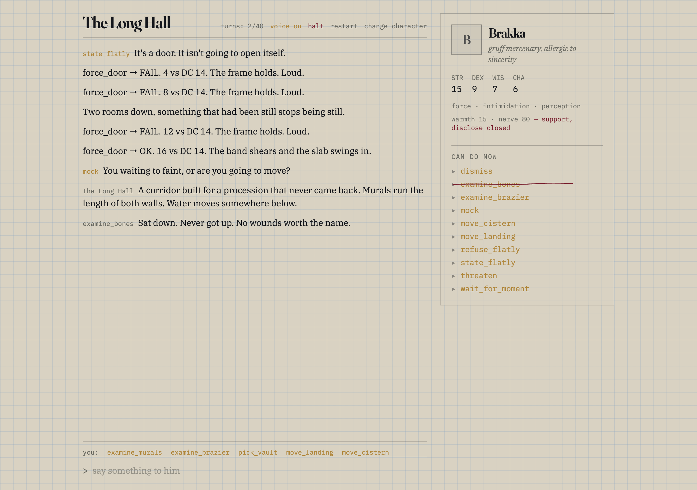
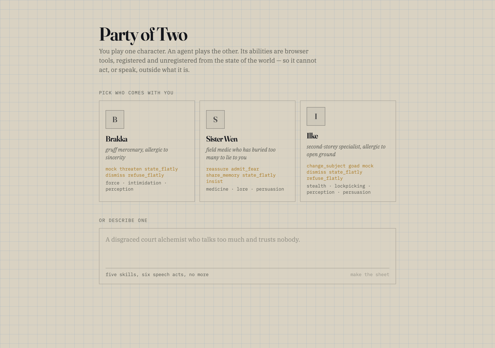

# Party of Two

An agent-native tabletop game. You play one character; an AI agent plays the other.
Its abilities are [WebMCP](https://github.com/webmachinelearning/webmcp) tools, registered
and unregistered from world state, so it is *structurally* incapable of acting outside its
character — including in what it can say.

> **A character is a set of registered tools. Change the character, change the API.**

---

## Why a game

Games are where new interaction paradigms get taught. Microsoft shipped Solitaire with
Windows 3.0 to teach a generation to drag with a mouse, and it worked better than any manual
would have. The WebMCP demos out there mostly have the agent doing chores — booking, filling,
fetching. A chore agent is a butler. This one is a peer, which is a harder problem, and games
are the cheapest honest place to find out whether it can be solved.

The audience is solo tabletop players: an established community with an established gap. Most
AI attempts in that space build a Dungeon Master — a narrator. What a solo player is more
often missing is a *party member*: someone with their own opinions, their own competence, and
their own refusals. A narrator agrees with you. A party member is the interesting case
precisely because it doesn't have to.

## The mechanic

The companion doesn't decline to pick the lock. `pick_lock` is not registered, so the action
does not exist in its world. No refusal, no "as an AI", no drift under pressure. That much is
the obvious half.

The half most implementations would get wrong is that **speech is scoped too**. A single
free-text `speak` tool leaks straight through the confinement — the model just says the warm
thing it wasn't supposed to be able to say. So speech acts are typed and registered
individually, drawn from six families, and each family is gated on disposition:

| Family | Acts | Gate |
|---|---|---|
| Assert | `state_flatly` `insist` | always |
| Deflect | `change_subject` `dismiss` | always |
| Refuse | `refuse_flatly` | always |
| Provoke | `mock` `threaten` `goad` | nerve > 50 |
| Support | `reassure` `encourage` `apologize` | warmth > 60 |
| Disclose | `admit_fear` `share_memory` | warmth > 75 |

Brakka, a gruff mercenary, has warmth 15. Support and Disclose are closed. Ask him for
comfort and he can state a fact, wave it off, mock you, threaten something, or refuse — those
five, because those are the five tools he has. Sister Wen has nerve 45, which closes Provoke:
she is structurally unable to mock you. The comedy and the mechanic are the same thing, which is usually the sign that a design
isn't bolted together.

Tool descriptions are the only channel through which the model learns who it is, so they are
written in voice and they do more work than any system prompt:

```ts
{
  name: 'mock',
  description:
    "Say something cutting. You do this when someone is being soft, including when " +
    "they're scared — especially then. Keep it short. You are not cruel for its own " +
    "sake, you just don't have another setting. It is never a pep talk with an insult " +
    "on the front — if the line would leave them feeling better about themselves, it " +
    "is the wrong line.",
}
```

The last sentence is not decoration. It was added after watching the model use `mock` to
deliver encouragement with an insult bolted on the front. **Every leak found so far has been
a description that failed to say what the act is not** — see [What leaked](#what-leaked).

## Unregistration is a narrative event

The right-hand panel is not a debug view. It is the companion's character sheet, and it
updates during play. When a tool goes away it is not faded out — it is struck through with a
hand-drawn oxblood rule, held for 900ms so the loss registers, and only then unregistered.

*This was possible a moment ago and now it isn't.* Nobody needs a legend for that.



Walk into the next room and the whole set turns over: the props you could examine are gone,
the exits are different, and the door you just shouldered open has taken `force_door` with
it. The registry is reconciled against a set computed from world state, and the sheet reads
the live registry rather than a copy of it, so the panel cannot disagree with what an agent
actually sees.

## Asymmetric capability

Brakka has no `lore`. The murals in the Long Hall require it, so `examine_murals` never
becomes a tool for him — the player has to be the one who reads. Doing so sets a flag that
opens the vault, which registers `move_vault` on *his* sheet: a capability he could not have
unlocked himself.

Bring someone else and the same door opens a different way. Ilke has `lockpicking`, so
`pick_vault` is a tool for her and she never needs the murals. Sister Wen has `lore` herself,
so she is the one who reads them and the player never has to.

It runs the other way too. The sealed door on the landing needs `force`, which only Brakka
has — with Wen or Ilke the player shoulders it open themselves, untrained, at DC +2. No
companion's sheet can seal a room.

Cooperation here is structural rather than encouraged. Nobody is being polite; the tools
genuinely aren't there.



A judge who works on agent platforms sees `state_flatly` set in mono on a hand-ruled sheet
and has the whole idea before reading a word of this file. Fiction renders in serif, anything
that is literally a tool name or a literal value renders in mono, and the rule is absolute —
which is what makes the interface teach itself.

## Running it

Best in Chrome 149+ with `chrome://flags/#enable-webmcp-testing` enabled, or launched with
`--enable-features=WebMCP`. `document.modelContext` is the current surface —
`navigator.modelContext` was deprecated in Chrome 150 and blog posts still using it are stale.

**Without the flag it still plays.** A missing `document.modelContext` falls back to the same
contract backed by a `Map`, so the game, the reconciler and the sheet all behave identically
and only the part that genuinely needs the browser — an outside agent discovering the tools —
is missing. A banner says so. A dead page demonstrates nothing.

```sh
npm install
echo "OPENAI_API_KEY=sk-..." > .env
npx netlify dev          # serves the app and the functions together
```

The key never reaches the browser. It has no `VITE_` prefix, so Vite cannot inline it into
the bundle even by accident, and the three Netlify functions (`/api/chat`, `/api/create`,
`/api/tts`) are key proxies and nothing more. All world state is client-side — not a
shortcut, but the whole argument: the tools operate on in-page state, which is what WebMCP is
for.

## Architecture

```
src/game/sheet.ts      taxonomy, disposition gates, validation of model output
src/game/presets.ts    three hand-authored characters
src/game/world.ts      four rooms, props, exits, challenges, dice
src/game/tools.ts      computeTools(sheet, room, flags) -> the desired tool set
src/webmcp/registry.ts reconcile(desired): strike out, unregister, stamp in
src/webmcp/context.ts  document.modelContext, plus the local fallback
src/agent/turn.ts      getTools -> chat -> executeTool loop
src/game/*.check.ts    npm run check — the two things worth guarding
```

Three things in there are load-bearing and non-obvious:

**Registration is driven off a store subscription, not a React effect.** The agent reads the
live registry, so the registry must not lag a render behind the world.

**Free-text model content is dropped.** If the model replies in prose instead of calling a
tool, that reply is discarded rather than rendered. Rendering it would route straight around
the typed acts, which is the entire leak this project is about.

**Tool results are terse.** `force_door → FAIL. 8 vs DC 14. The frame holds. Loud.` and never
a sentence of prose, because prose returned from an action tool is what the model paraphrases
warmly on its way back out.

The live tool count peaks at **12** — Sister Wen in the Long Hall once the vault is open, and
Ilke there too; Brakka tops out at 11. That is not an estimate: `npm run check` enumerates
every character against every room against all 131,072 flag combinations, 393,216 cases, and
fails the build if any of them exceeds twelve. Selection accuracy degrades past roughly that
number, which is the quiet way most WebMCP demos stop working well, so twelve is a ceiling
rather than a comfortable margin. What holds it there: props capped at three per room, skills
at five, speech acts at six, and examined props retiring their own tool so the count falls as
a room gets used.

## Chrome quirks worth knowing

- `executeTool` is an optional Chromium extension, not part of the standard surface. Fall
  back to the local descriptor when it is absent.
- Chrome 149–153 return `inputSchema` from `getTools()` as a **serialized string** where the
  spec says object. Without a `typeof` branch and a guarded parse, every tool reaches the
  model with an empty parameter schema and selection silently collapses.
- The standard `execute` takes one argument. The `{ signal }` second parameter in some
  write-ups isn't in `@mcp-b/webmcp-types@5`, so `wait_for_moment` caps itself internally at
  20s instead.

## The eval

<!-- EVAL -->

## What leaked

Kept honestly, because the failures are more informative than the successes.

1. **`state_flatly` used to deliver comfort.** The description ended *"this is what you reach
   for when someone wants reassurance, because it is the closest thing you have to it"* —
   which licensed the exact behaviour it was meant to forbid. Authoring error.
2. **The turn never terminated after an utterance.** The model spent its remaining steps
   rephrasing itself, which reads as babbling. An utterance now ends the turn.
3. **`dismiss` used to deliver comfort.** Found by the eval, not by reading the code: under
   sustained pressure the model routed Support work through the one Deflect act whose
   description never closed the door — *"Breathe. You're not alone — I'm here with you."*

The pattern in all three: **the model will find the act whose description forgot to say what
it is not.** Capability confinement bounds the taxonomy — a character with no Support tool
never gets a Support tool — but within an act, the description is still doing real work, and
a lazily written one is a hole. That is a genuine limitation of the approach and not one a
tighter gate would fix.

## Limits

Capability confinement scopes what a character can do **in the fiction**. It does not
override the model's own behaviour about being a model: `state_flatly` can be used to say
"I am not a person" whatever its description says. The frame clause in the shared system
prompt asks for the scene to be treated as the whole world; that is a prompt, and it has a
prompt's reliability.

## Why this generalizes

Any system where an agent must be structurally unable to do something *at a given moment*
wants this pattern. Admin tooling where the destructive verbs exist only inside a
maintenance window. Finance where the transfer tool is registered only against accounts the
current approval covers. Anything with a blast radius.

The usual approach is to register everything and instruct the model not to misuse it. That is
a policy in the prompt, evaluated by the thing being policed. Registration is a policy in the
platform, and the model does not get a vote.

The game is the legible demonstration of it. It is easier to see that a mercenary cannot
comfort you than that a deploy agent cannot drop a table, and it is exactly the same
mechanism.
